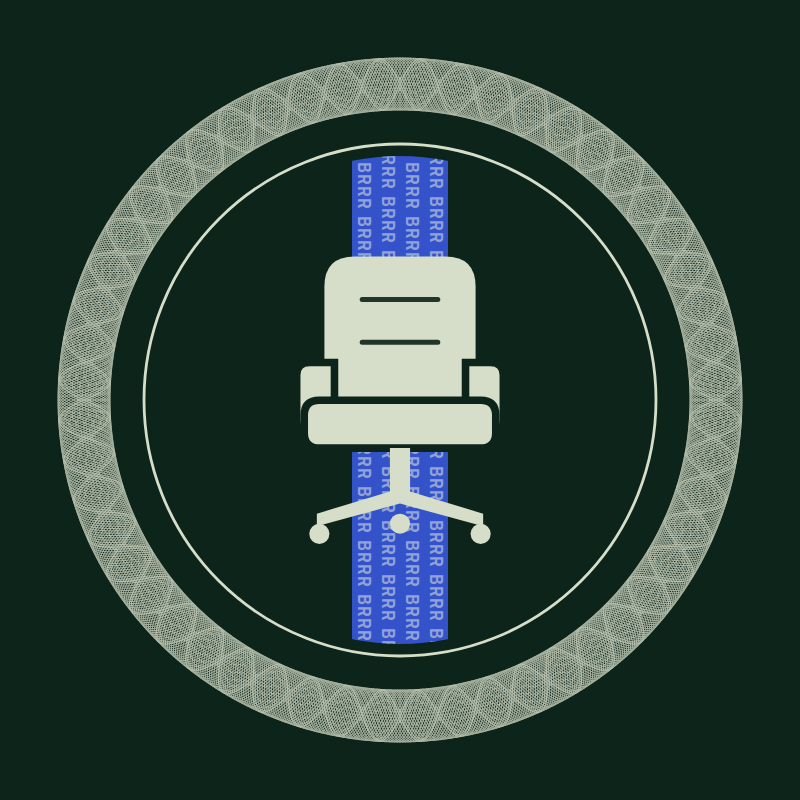

# Take The Chair

**$CHAIR · Robinhood Chain · launched on Pons**
Hold $CHAIR. Get paid in stocks.

Site: [takethechair.org](https://takethechair.org) · X: [@TTC_SPY](https://x.com/TTC_SPY)

---

## What it is

Take The Chair is a coin whose trading fees buy real stock tokens on Robinhood Chain and hand them to holders. Which stock gets bought is decided by one person: whoever is sitting in **the Chair**.

- **Every trade fills the Press.** A cut of every $CHAIR buy and sell is paid in SPY to a contract called the Press. Nobody holds it and nobody can touch it.
- **The Chair picks the stock.** Spend more SPY than the takeover price buying $CHAIR through the site and the seat is yours. You choose what the Press buys next: NVDA, TSLA, AAPL, anything on the list. Keep what you bought or anyone can remove you.
- **BRRR.** When the Press is full, anyone presses BRRR. The Press buys the Chair's pick at a price checked against Chainlink, pays the Chair a 2% salary, tips whoever pressed, and sets the rest aside for every holder.
- **You just hold.** No staking, no locking. Your share of each print is your average $CHAIR balance since the last one. Claim it from the site whenever you like.

## How the Press fills

Pons pairs the launch with SPY, so fees arrive as SPY from the very first trade. Pons credits creator fees to its fee escrow rather than sending them anywhere; the Press is set as the creator fee recipient and claims its own fees each time someone presses BRRR.

The site reads all of this live from the chain:

| Read | Contract | What it tells you |
| --- | --- | --- |
| `pressBalance()` | Press | SPY in the Press plus SPY waiting in the Pons escrow |
| `chair()` / `pick()` / `takeoverPrice()` | Press | who sits, what they picked, what it costs to take the seat |
| `canPrint()` | Press | whether BRRR would go through right now |
| `forHolders(stock)` | Press | stock set aside for holders so far |
| `getLaunchedToken(token)` | Pons V2 factory `0x7eD5…EC7e` | pair token, fee recipient, graduation phase |

## The numbers

| Rule | Setting |
| --- | --- |
| Pair | SPY |
| Takeover price | 110% of the sitting Chair's buy, decaying to the minimum over 2 hours |
| Chair's salary | 2% of each print, only while they hold their stake |
| Gap between prints | 5 minutes minimum |
| BRRR tip | 0.1% of each print |
| Price check | Swap must land within 1% of Chainlink |
| Allowed picks | Official Robinhood stock tokens only |
| Claim delay | 5 minutes after each result is posted |
| Supply | 1,000,000,000, fixed by Pons |
| Admin | None. No owner, no pause, no upgrade. One key posts print results and can do nothing else. |

## Contracts

`contracts/` is a Foundry project. Start with [`contracts/README.md`](contracts/README.md).

| Contract | Does |
| --- | --- |
| [`Press.sol`](contracts/src/Press.sol) | Holds the SPY, seats the Chair, runs BRRR, pays holders by Merkle claim. No owner. |
| [`TakeoverDesk.sol`](contracts/src/TakeoverDesk.sol) | The only way to take the Chair: buys $CHAIR with your SPY and seats you in one transaction. |
| [`PonsBuyRoute.sol`](contracts/src/adapters/PonsBuyRoute.sol) | Buys $CHAIR on the Pons bonding curve before graduation, on the Uniswap v4 pool after. |
| [`UniswapV4Swapper.sol`](contracts/src/adapters/UniswapV4Swapper.sol) | Swaps SPY into the Chair's pick on Uniswap v4. |

24 tests. `forge test` runs them. Not audited.

`tally/` is the script that works out every holder's share after each print and publishes the full list to `tally/results/`. Anyone can rerun it and check the fingerprint posted to the Press.

## Status

| Piece | State |
| --- | --- |
| Site | live, with wallet connection |
| Press, desk and adapters | complete, 24 tests passing, not audited |
| The Tally | complete |
| Token on Pons | 14 September 2026 |

Contract addresses are posted on [@TTC_SPY](https://x.com/TTC_SPY) first and on the site straight after. Any address you see before that isn't ours.

## Honest bits

Take The Chair is not affiliated with Robinhood Markets, Inc. or Pons. Stock tokens on Robinhood Chain are not shares and carry no shareholder rights; they are not available in the US and are restricted in some other places. The contracts are new and unaudited. Nothing here is financial advice.
